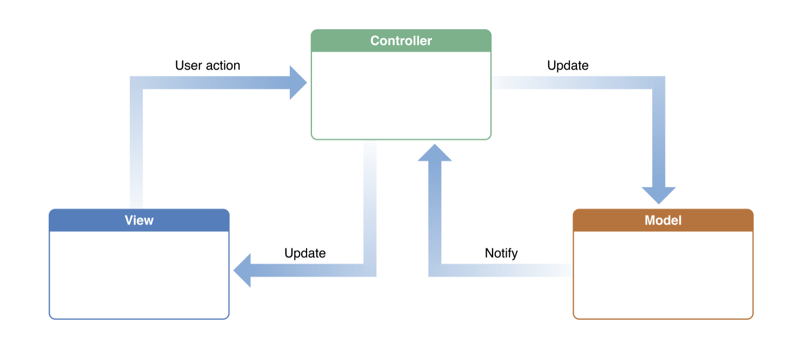

# Model View ViewModel 

Model View Controller Architecture Design Pattern is the most common architecture found in iOS apps.  MVC patterns consist of three layers namely Model, View and Controller.

1. **Model**
     Models are representations of application data and it encapsulate the data specific to an application and define the logic and computation that manipulate and process that data. Things such as objects, network code, parsing code and so on reside here.

2. **View**
     A view object is an object in an application that users can see. A major purpose of view objects is to display data from the application’s model objects and to enable the editing of that data.Thing of when your using the storyboard to design application layout that is connected to the code. View contents items such as UILabels, UIViews and UIImage reside in this layer.

3. **ViewModel**
     A controller object acts as an intermediary between one or more of an application’s view objects and one or more of its model objects. Controllers set up views with the data from models and update models when users interact with views.

## How MVVM Works ?

     A controller object interprets user actions made in view objects and communicates new or changed data to the model layer. When model objects change, a controller object communicates that new model data to the view objects so that they can display it.

